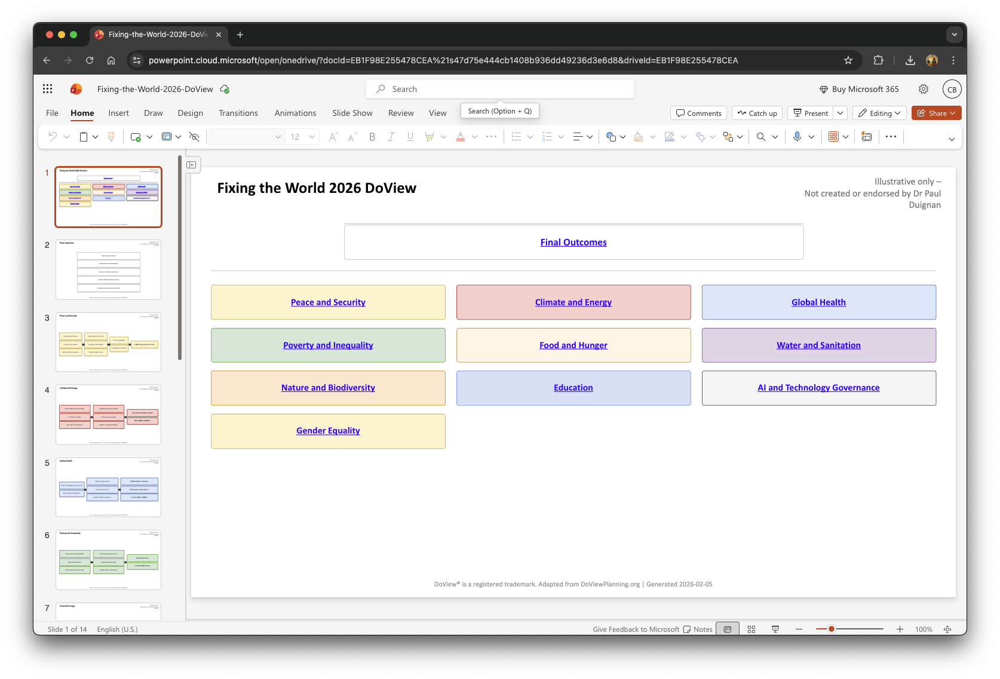
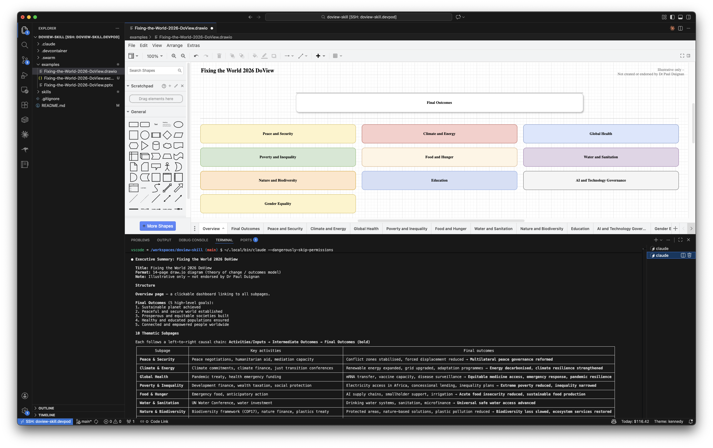
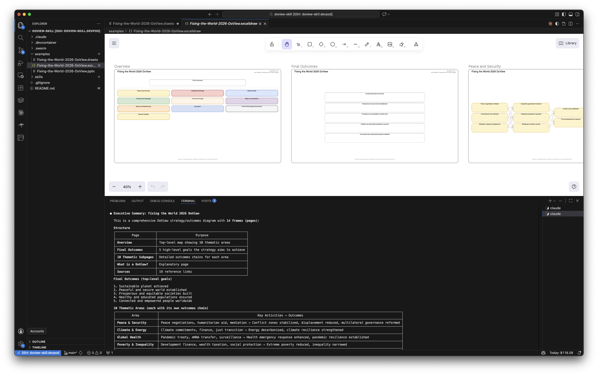

# DoView Planning Skills

Claude Code skills for generating DoView strategy/outcomes diagrams (theory of change visualizations).

## What is DoView?

DoView is a visual diagram methodology that shows the theory of change for an initiative, program, or strategy. It maps causal relationships between activities, outputs, and outcomes, flowing left-to-right to show how earlier achievements lead to later results.

*DoView is Open and Free to Use.* The methodology is open and free for anyone to use. You just need to acknowledge that you are using DoView Planning and building DoView diagrams. See the **Attribution** section below.

## Available Skills

| Skill | Output Format | Path |
|-------|--------------|------|
| **doview** | PowerPoint (`.pptx`) | [`skills/doview/SKILL.md`](skills/doview/SKILL.md) |
| **doview-drawio** | draw.io (`.drawio`) | [`skills/doview-drawio/SKILL.md`](skills/doview-drawio/SKILL.md) |
| **doview-excalidraw** | Excalidraw (`.excalidraw`) | [`skills/doview-excalidraw/SKILL.md`](skills/doview-excalidraw/SKILL.md) |

### Which skill should I use?

All three skills share the same interactive three-stage workflow and produce identical DoView content — they differ only in output format and tooling.

| If you want to... | Use |
|---|---|
| Share polished slides with stakeholders or present in meetings | **doview** (PowerPoint) |
| Edit the diagram iteratively in a desktop app or embed in wikis/docs | **doview-drawio** (draw.io) |
| Get a hand-drawn whiteboard aesthetic, or use Excalidraw/Obsidian | **doview-excalidraw** (Excalidraw) |

**doview (PowerPoint)** — Generates Python code using `python-pptx` to produce a PowerPoint presentation. Best for boardroom decks, stakeholder briefings, or anything destined for PowerPoint/Google Slides. Requires `pip install python-pptx`.



**doview-drawio (draw.io)** — Generates draw.io XML directly — no code execution or dependencies required. Opens in [draw.io](https://app.diagrams.net), diagrams.net, or the [VS Code draw.io extension](https://marketplace.visualstudio.com/items?itemName=hediet.vscode-drawio). Good for teams already using draw.io/diagrams.net, includes support for tabs, links.



**doview-excalidraw (Excalidraw)** — Generates Excalidraw JSON directly — no code execution or dependencies required. Opens in [Excalidraw](https://excalidraw.com), the [VS Code Excalidraw extension](https://marketplace.visualstudio.com/items?itemName=pomdtr.excalidraw-editor), or [Obsidian](https://obsidian.md) with the Excalidraw plugin. Choose between a sketchy hand-drawn look or a clean professional style.



Because draw.io and Excalidraw output plain text formats (XML and JSON), Claude Code can read, edit, and rewrite them directly. This enables a fully interactive workflow — create a DoView, preview it in your editor, then refine through conversation:

- "Move the 'Funding secured' box to column 3"
- "Add a new outcome between 'Staff trained' and 'Service delivered'"
- "Split the 'Operations' subpage into two pages"
- "Change the color scheme on the overview page"

## How It Works

All three skills follow the same three-stage interactive workflow:

1. **Setup questions** — understand your initiative, naming, scope, and preferences
2. **Subpage structure** — draft and refine the high-level page layout with user approval
3. **Detailed content** — develop box content using "This-Then" causal logic, then generate the output file

After generation, the draw.io and Excalidraw skills support ongoing refinement — keep the conversation going to reshape the diagram iteratively.

## Features

- Interactive question-based workflow with user checkpoints
- "This-Then" causal logic for outcome mapping
- Outcome-focused phrasing (ending in "-ed")
- Automatic page/slide ordering and layout
- Color-coded boxes with proper formatting
- Arrow connectors showing causal flow
- Overview, Final Outcomes, and Sources pages
- Configurable spelling, disclaimers, and page dimensions
- **draw.io & Excalidraw**: post-generation editing via natural language conversation
- **draw.io & Excalidraw**: no runtime dependencies — output is pure markup/JSON
- **Excalidraw**: hand-drawn or clean visual style
- **Excalidraw**: frames-on-canvas or separate-files page organization

## Installation

Copy the `SKILL.md` file for the skill you want into your Claude Code commands directory:

```bash
# PowerPoint skill
cp skills/doview/SKILL.md ~/.claude/commands/doview.md

# draw.io skill
cp skills/doview-drawio/SKILL.md ~/.claude/commands/doview-drawio.md

# Excalidraw skill
cp skills/doview-excalidraw/SKILL.md ~/.claude/commands/doview-excalidraw.md
```

Then invoke with `/doview`, `/doview-drawio`, or `/doview-excalidraw` in Claude Code.

## Attribution

This skill is adapted from [DoViewPlanning.org](https://www.doviewplanning.org) – AI DoView Drawing Prompt, created by Dr Paul Duignan.

DoView® is a registered trademark. Use of DoView® Marks must comply with the DoView® Planning [Attribution & Trademark Use Policy](https://www.doviewplanning.org/trademarkuse) on DoViewPlanning.org.

## License

Free to use, copy, share, and adapt for any purpose (including commercial) with attribution. See the skill files for full terms.
